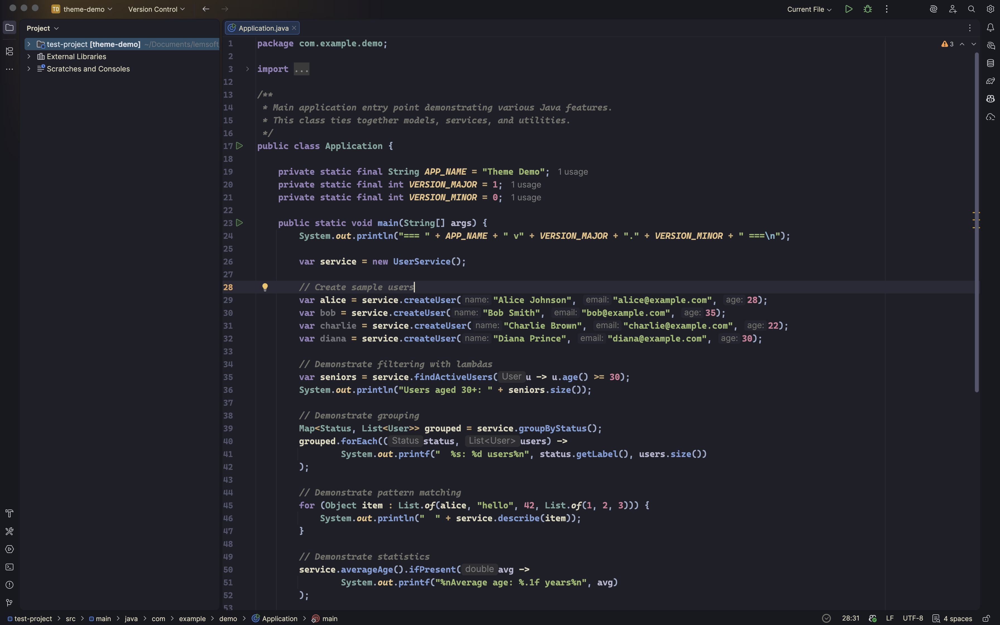
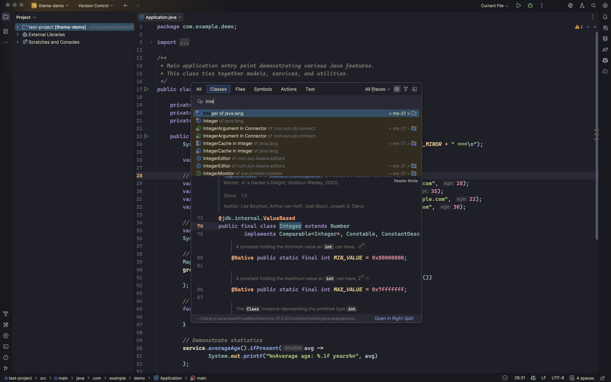
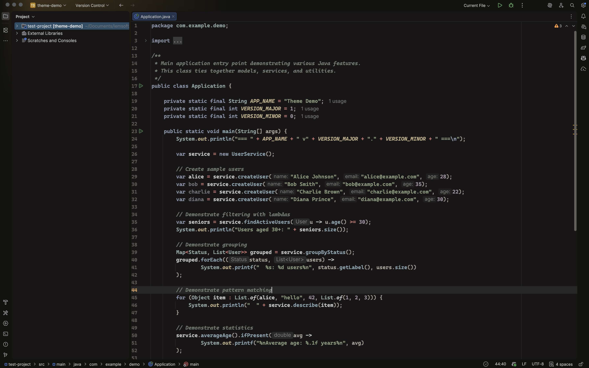
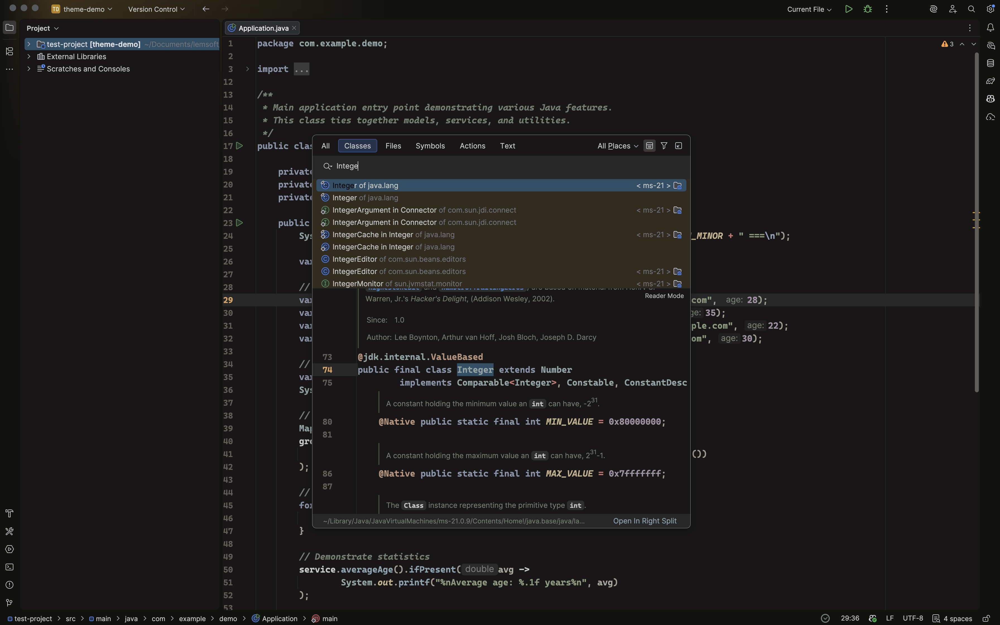
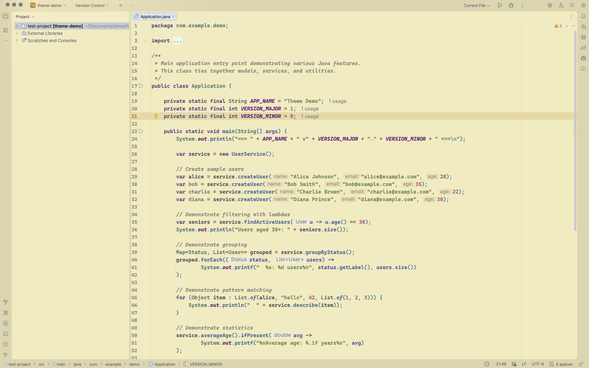
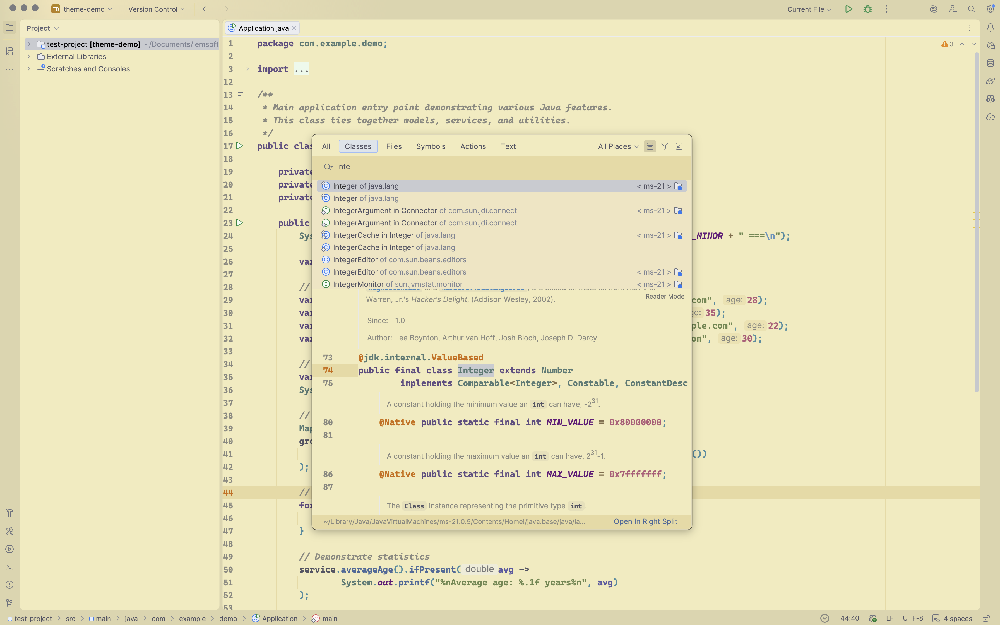

<div align="center">


# Kanagawa Colors Theme

A JetBrains IDE color theme inspired by [kanagawa.nvim](https://github.com/rebelot/kanagawa.nvim) — the iconic palette of *The Great Wave off Kanagawa* by Katsushika Hokusai.

[](https://plugins.jetbrains.com/plugin/com.github.followlemmi.kanagawa)
[](LICENSE)

</div>

---

## Wave — Dark Default

Deep ocean tones with warm foreground colors. Rich contrast for everyday use.

<p>
  
  
</p>

## Dragon — Dark Muted

Earthy, subdued palette with lower contrast. Easy on the eyes for long sessions.

<p>
  
  
</p>

## Lotus — Light

Warm parchment backgrounds with rich, saturated syntax colors.

<p>
  
  
</p>

---

## Installation

### From JetBrains Marketplace

1. Open **Settings** > **Plugins** > **Marketplace**
2. Search for **Kanagawa Colors Theme**
3. Click **Install** and restart the IDE

### From Disk

1. Download the latest `.zip` from [Releases](https://github.com/followLemmi/jetbrains-kanagawa-colors/releases)
2. **Settings** > **Plugins** > gear icon > **Install Plugin from Disk...**
3. Select the `.zip` and restart

### Activate

**Settings** > **Appearance & Behavior** > **Appearance** > **Theme** and choose:
- **Kanagawa Wave**
- **Kanagawa Dragon**
- **Kanagawa Lotus**

## Compatibility

- IntelliJ IDEA 2024.2+
- All JetBrains IDEs based on IntelliJ Platform 2024.2+ (WebStorm, PyCharm, GoLand, CLion, etc.)

## Building from Source

```bash
./gradlew buildPlugin
```

The plugin `.zip` will be in `build/distributions/`.

To launch a sandboxed IDE for testing:

```bash
./gradlew runIde
```

## Credits

- Color palette by [rebelot/kanagawa.nvim](https://github.com/rebelot/kanagawa.nvim)
- Inspired by *The Great Wave off Kanagawa* by Katsushika Hokusai

## License

[MIT](LICENSE)
